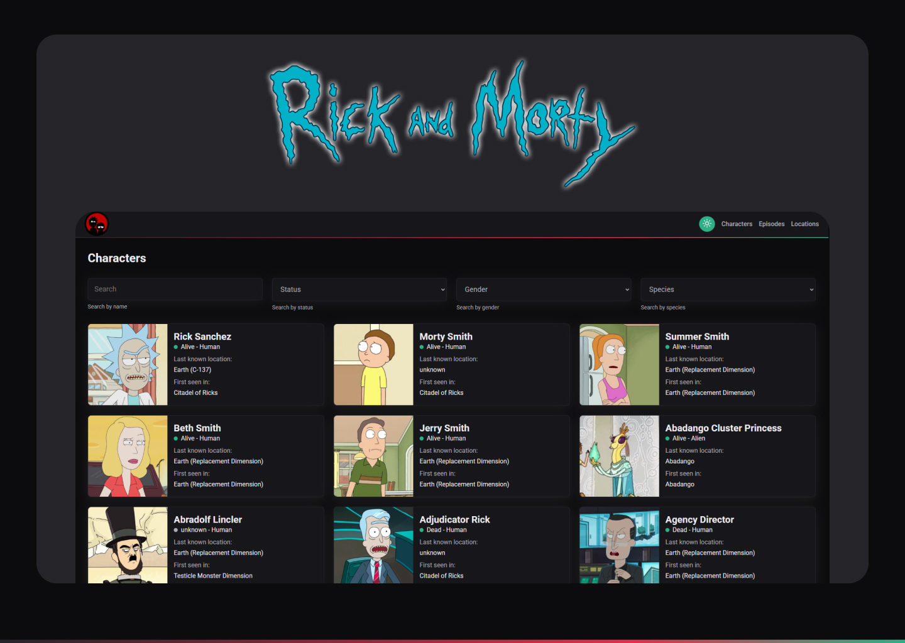

# Rick and Morty



## Descrição

Este projeto é uma aplicação web desenvolvida para explorar informações sobre os personagens, episódios e locais do universo de Rick and Morty. A aplicação utiliza a [Rick and Morty API](https://rickandmortyapi.com/) para fornecer dados detalhados.

## Funcionalidades

- **Listagem de personagens, episódios e locais**
- **Sistema de busca e filtros para encontrar informações específicas.**
- **URL state para persistência de filtros e parâmetros de navegação.**
- **Paginação para navegação entre resultados.**
- **Interface responsiva e design amigável.**
- **Modo dark e light**

## Tecnologias Utilizadas

- **Angular 19**
- **TypeScript**
- **Sass**
- **lucide-angular**

## Instalação

Clone o repositório e instale as dependências usando npm ou yarn.

```bash
git clone https://github.com/lanDev01/rickAndMorty.git
cd rickAndMorty
npm install
# ou
yarn install
```

## Contribuindo

Contribuições são sempre bem-vindas!

    1. Faça um fork deste repositório.
    2. Crie uma branch para sua feature ou correção de bug: git checkout -b minha-feature.
    3. Commit suas alterações: git commit -m 'Minha nova feature'.
    4. Faça um push para a branch: git push origin minha-feature.
    5. Abra um Pull Request.

## Licença

Esta aplicação cobre todas as seções essenciais, como funcionalidades, instalação, configuração, tecnologias utilizadas, como contribuir e a licença [MIT](https://choosealicense.com/licenses/mit/).
